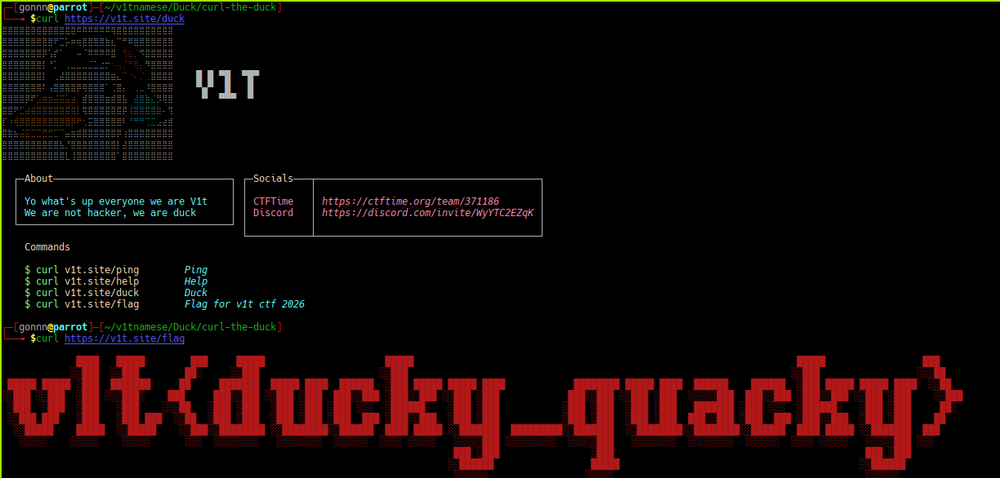

# 🦆 Curl the Duck

## Challenge Information

| Item | Value |
|------|-------|
| Category | Duck |
| Challenge | Curl the Duck |
| Points | 18 |

---

## Description

> Just .... `curl v1t.site/duck`

---

## Objective

Retrieve the hidden flag using the `curl` command-line tool.

---

## Solution

### Step 1 - Read the Challenge Hint

The challenge explicitly suggested using `curl` instead of accessing the website through a browser.

```bash
curl https://v1t.site/duck
```

The response displayed an ANSI-art interface instead of the flag.

It also listed several available endpoints:

```
curl v1t.site/ping
curl v1t.site/help
curl v1t.site/duck
curl v1t.site/flag
```

---

### Step 2 - Curl the Flag File

Following the available commands, I requested the `/flag` endpoint.

```bash
curl https://v1t.site/flag
```
and see the flag



---

## Flag

```text
V1T{ducky_quacky}
```

---


