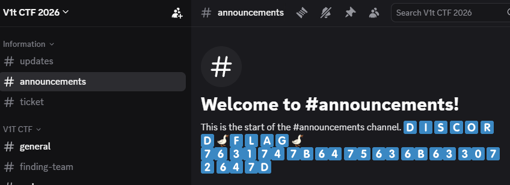
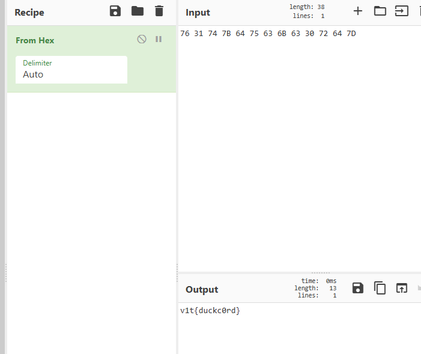

# 🦆 Discord

## Challenge Information

| Item | Value |
|------|-------|
| Category | Duck |
| Challenge | Discord |
| Points | 36 |

---

## Description

> Welcome to Discord

---

## Objective

Join the official V1T CTF Discord server and retrieve the hidden flag.

---

## Solution

### Step 1 - Join the Discord Server

The challenge provided an invitation link to the official Discord server.

```
https://discord.com/invite/WyYTC2EZqK
```

After joining the server, I navigated to the **#announcements** channel.

---

### Step 2 - Locate the Encoded Message

Inside the announcement channel, I found a message labeled **FLAG** followed by the following hexadecimal string:

```
76 31 74 7B 64 75 63 6B 63 30 72 64 7D
```



---

### Step 3 - Decode the Message

The data consisted of two-character hexadecimal values (0-9 and A-F), indicating that it was ASCII text encoded in hexadecimal.

I copied the encoded string into **CyberChef** and used the following recipe:

```
From Hex
```



CyberChef converted the hexadecimal values into readable ASCII text.

---

## Flag

```text
V1T{duckc0rd}
```

---

## Lessons Learned

- Always inspect official communication channels provided by a challenge.
- Hexadecimal encoding is a common way to hide ASCII text in CTFs.
- CyberChef provides a quick and reliable method for decoding common encodings.
- Recognizing common data formats helps identify the correct decoding technique quickly.
