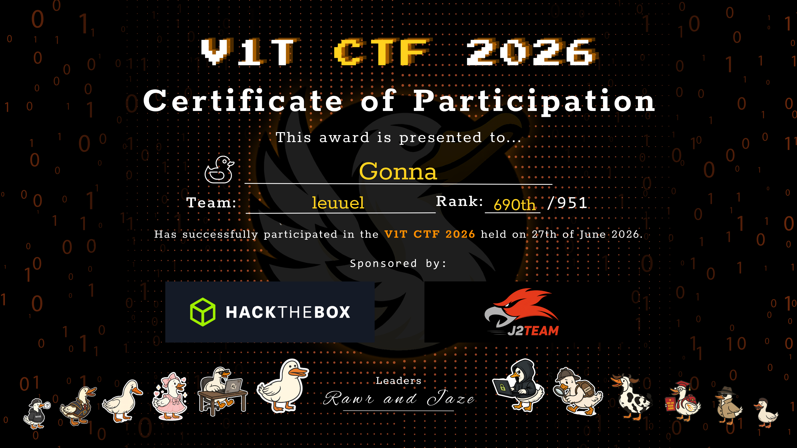

## About

This repository contains my write-ups, solutions, and learning notes from participating in **V1T CTF 2026**.

The competition provided hands-on experience in:

- 🌐 Web Security
- 🔍 OSINT
- 🔐 Cryptography
- ⚙️ Reverse Engineering
- 🐧 Linux
- 💻 Scripting

Sponsored by **Hack The Box** and **J2Team**.
---
## Challenge Write-ups

| Category | Status |
|----------|--------|
| Web | 🚧 In Progress |
| OSINT | 🚧 In Progress |
| Crypto | 🚧 In Progress |
| Reverse | 🚧 In Progress |
| Misc | 🚧 In Progress |
---
## Certificate

---
## Achievement

- 🎖 Certificate of Participation
- 👥 Team: leuuel
- 📊 Rank: **690 / 951**
- 📅 Date: June 2026
---
## Skills Developed

- Linux command line
- HTTP requests
- Source code analysis
- Information gathering (OSINT)
- Basic scripting
- Problem solving
